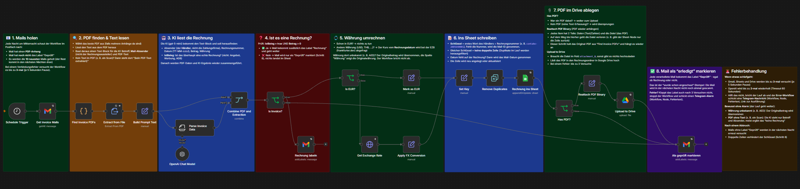

# n8n Workflows

Beispiel-Workflows aus meiner Automatisierungspraxis (n8n, self-hosted auf einem VPS). Jeder Workflow hat einen eigenen Ordner mit Erklärung, Screenshots und den exportierten JSON-Dateien.

## Workflows

| Workflow | Was er macht | Ordner |
|---|---|---|
| **Lead Qualifizierung** | Prüft Kundenanfragen aus Formular und Postfach, bewertet sie mit einer KI, speichert sie in Airtable und meldet sich per Telegram. Hot-Leads brauchen vor der Antwort eine Freigabe per Klick. | [lead-qualifizierung](lead-qualifizierung/) |
| **E-Mail Rechnungserfassung** | Liest nachts Rechnungs-Mails, extrahiert die Daten per KI, rechnet Währungen um und schreibt alles in ein Google Sheet. | [email-rechnungserfassung](email-rechnungserfassung/) |

### Lead Qualifizierung

- Zwei Eingänge (Formular, E-Mail), Duplikat-Check, KI-Agent mit Impressum-Recherche
- Kategorien hot, warm, kalt, spam und rückfrage, mit Score und Antwort-Entwurf
- Freigabe für Hot-Leads per Telegram in einem eigenen Workflow
- Retry, KI-Fallback, Error-Workflow, Ping, feste Grenzen für die KI
- Live mit über 20 Testfällen geprüft

[Zur ausführlichen Beschreibung](lead-qualifizierung/README.md)

### E-Mail Rechnungserfassung

- Läuft jede Nacht, verarbeitet bis zu 10 Mails pro Lauf
- KI-Extraktion, Währungsumrechnung, Schlüssel gegen doppelte Einträge
- Retry, Error-Workflow mit Telegram-Alarm

[Zur ausführlichen Beschreibung](email-rechnungserfassung/README.md)

## Hinweise

- Credentials, IDs, Tabellen- und Ordner-Referenzen sind durch Platzhalter (`YOUR_..._ID`) ersetzt. Die Workflows lassen sich importieren, müssen aber mit eigenen Zugängen verknüpft werden.
- Die Sticky Notes in den Workflows erklären jeden Schritt.
