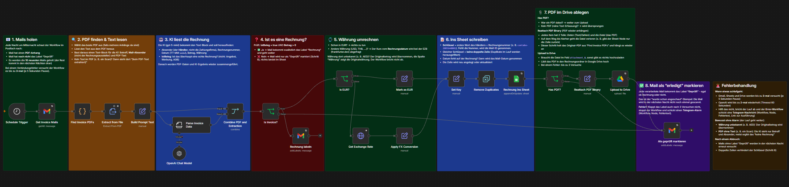
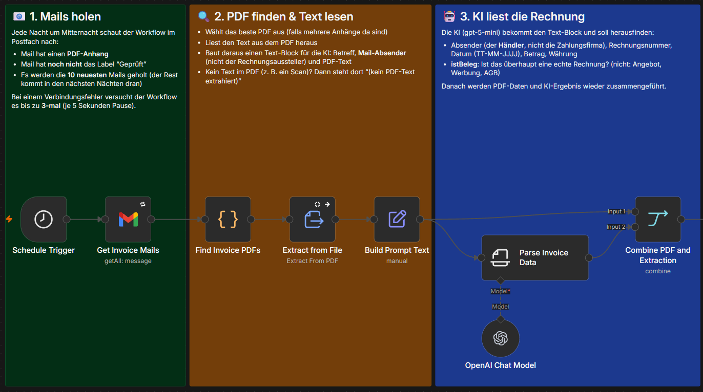
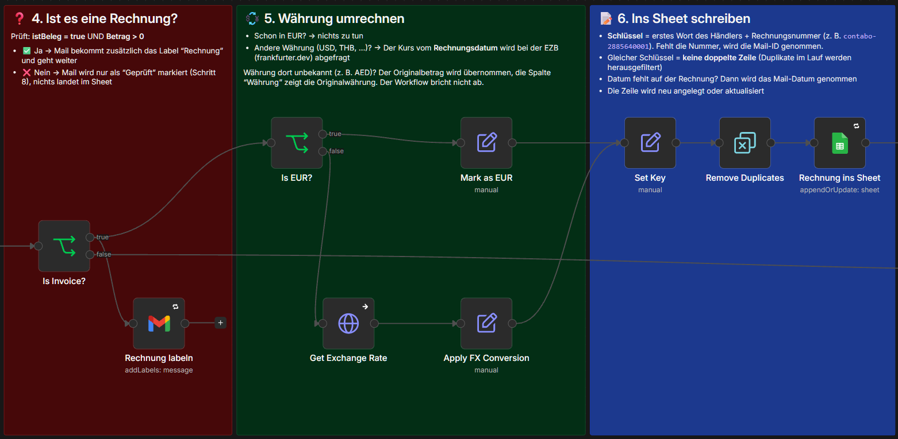
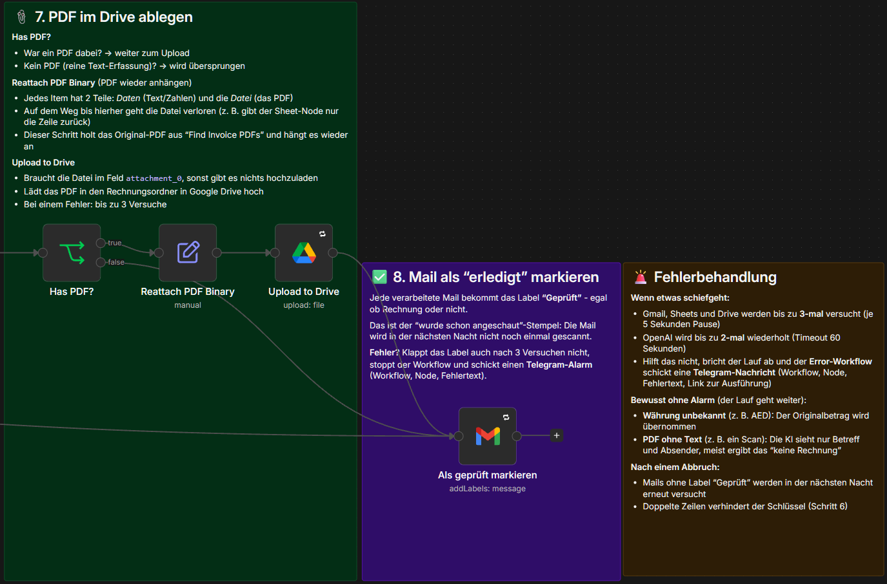
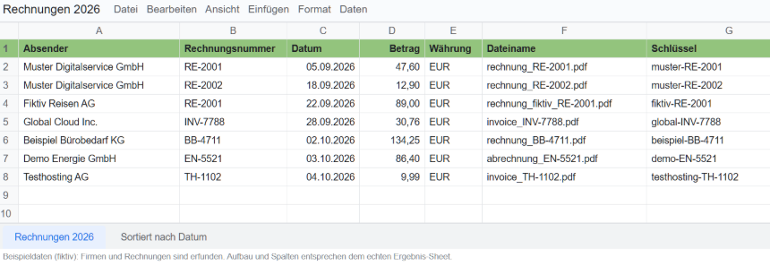

# n8n Workflows

Beispiel-Workflows aus meiner Automatisierungspraxis (n8n, self-hosted auf einem VPS).

## Workflows

### E-Mail Rechnungserfassung

Läuft jede Nacht im Hintergrund und verarbeitet neue Rechnungs-Mails (max. 10 pro Lauf).

- Holt Gmail-Mails mit PDF-Anhang, die noch nicht das Label "Geprüft" haben
- Liest das PDF und lässt ein LLM (gpt-5-mini, Information Extractor) Händler, Rechnungsnummer, Datum, Betrag und Währung extrahieren. Es entscheidet auch, ob es eine echte Rechnung ist (nicht Angebot, AGB oder Werbung)
- Rechnet Fremdwährungen mit dem EZB-Kurs vom Rechnungsdatum in EUR um (frankfurter.dev)
- Schreibt eine Zeile ins Google Sheet. Ein Schlüssel aus Händler und Rechnungsnummer verhindert doppelte Einträge
- Legt das PDF in Google Drive ab
- Setzt Gmail-Labels: "Geprüft" für jede verarbeitete Mail, zusätzlich "Rechnung" für echte Rechnungen

Workflow in drei Ausschnitten (besser lesbar)

Beispielausgabe im Google Sheet (erfundene Daten):

### Error Workflow (Rechnungserfassung)

Schickt bei einem abgebrochenen Lauf eine Telegram-Nachricht mit Workflow, Node, Fehlertext und Link zur Ausführung.

## Robustheit

- Retry (3 Versuche, 5 Sekunden Pause) bei Gmail, Sheets und Drive. OpenAI mit 2 Wiederholungen und Timeout
- Error-Workflow mit Telegram-Alarm
- Stabiler Schlüssel gegen doppelte Zeilen, auch nach einem Abbruch
- Bewusst ohne Alarm: unbekannte Währung (der Originalbetrag wird übernommen) und PDFs ohne Text
- Läuft bewusst ohne manuelle Freigabe (reine Hintergrund-Buchhaltung)

## Einrichtung

1. Workflows importieren und die Platzhalter (`YOUR_..._ID`) durch eigene Zugänge und IDs ersetzen (Gmail, OpenAI, Google Sheets, Google Drive, Telegram)
2. In Gmail die Labels "Geprüft" und "Rechnung" anlegen und in den beiden Label-Nodes auswählen
3. Ein Google Sheet mit den Spalten Absender, Rechnungsnummer, Datum, Betrag, Währung, Dateiname und Schlüssel anlegen
4. Im Rechnungs-Workflow unter Einstellungen den Error Workflow auswählen

## Hinweise

- Credentials, IDs, Tabellen- und Ordner-Referenzen sind durch Platzhalter ersetzt. Die Workflows sind so importierbar, müssen aber mit eigenen Zugängen verknüpft werden.
- Die Sticky Notes im Workflow erklären jeden Schritt.
