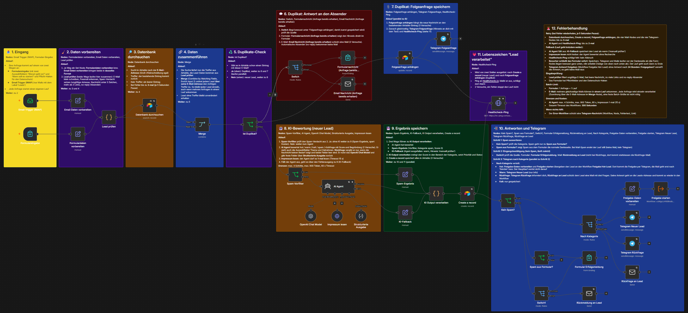
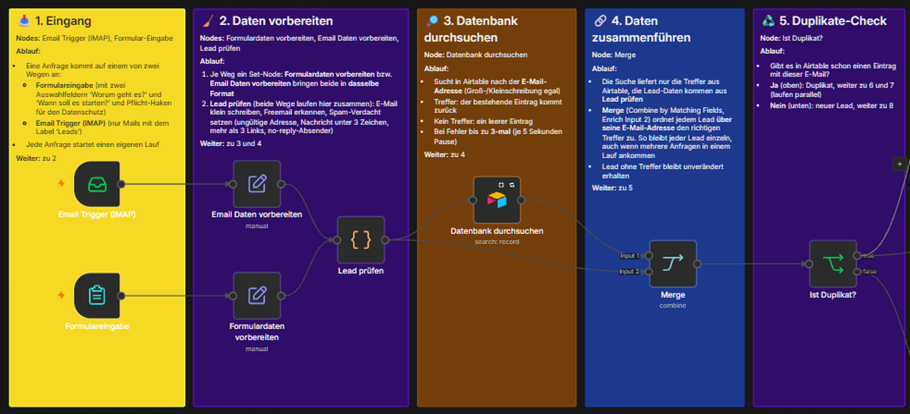
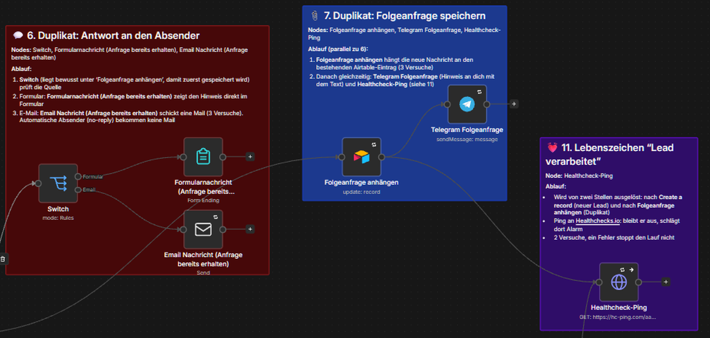
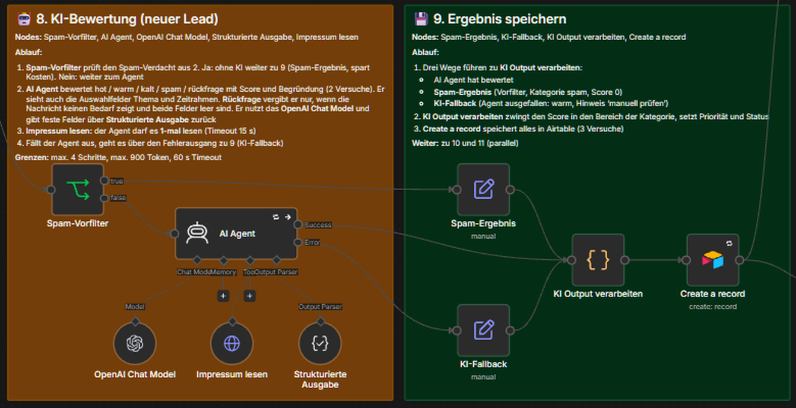
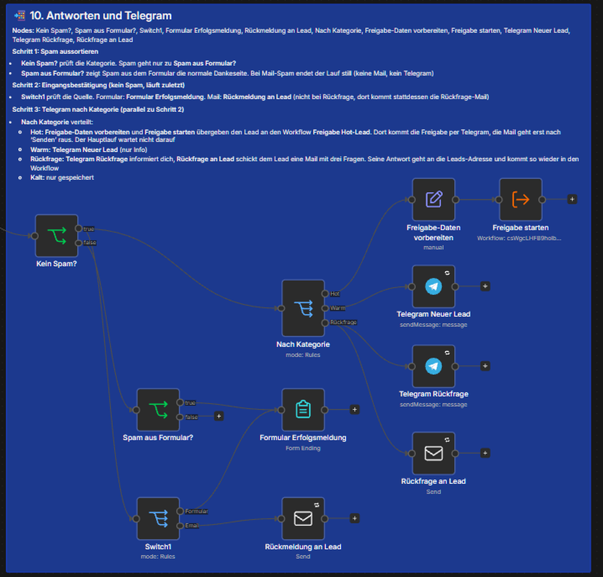
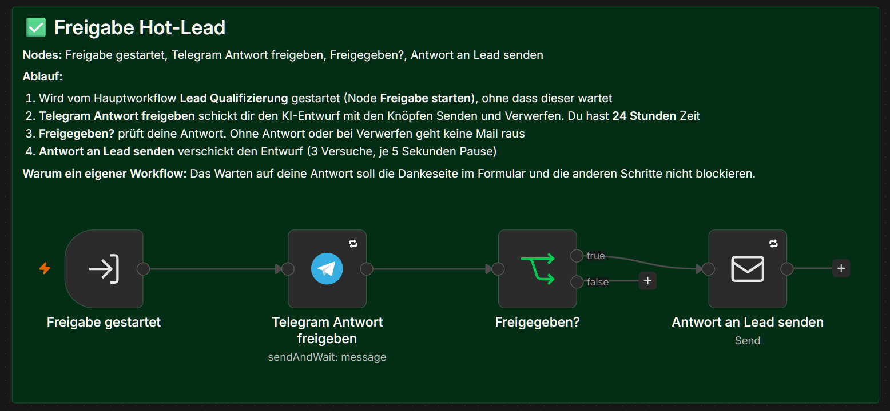

# Lead Qualifizierung

Prüft Kundenanfragen aus einem Formular und aus einem E-Mail-Postfach, bewertet sie mit einer KI, legt sie in Airtable ab und meldet sich per Telegram. Gedacht für Einzelunternehmer und kleine Firmen, die Anfragen nicht von Hand sortieren wollen.

## Was der Workflow macht

1. **Zwei Eingänge:** ein Kontaktformular (mit Datenschutz-Haken und zwei Auswahlfeldern) und ein E-Mail-Postfach (nur Mails mit dem Label "Leads").
2. **Vorprüfung:** beide Wege werden in dasselbe Format gebracht. Ungültige Adressen, fast leere Nachrichten, zu viele Links und no-reply-Absender gelten als Spam-Verdacht und gehen ohne KI weiter (spart Kosten).
3. **Duplikat-Check:** Airtable wird nach der E-Mail-Adresse durchsucht. Bei einem Treffer wird die neue Nachricht an den bestehenden Eintrag angehängt, der Absender bekommt "Anfrage bereits erhalten", und du bekommst eine Telegram-Info.
4. **KI-Bewertung:** Ein KI-Agent vergibt eine Kategorie (hot, warm, kalt, spam oder rückfrage) mit Score, Begründung und einem Antwort-Entwurf. Bei Firmen-Domains darf er einmal das Impressum lesen.
5. **Speichern:** Jeder Lead landet in Airtable (Status, Priorität, Score, Begründung, Recherche).
6. **Rückmeldung:**
   - **Hot:** Du bekommst den Antwort-Entwurf in Telegram und gibst ihn mit einem Klick frei (oder verwirfst ihn). Erst dann geht die Mail an den Lead.
   - **Warm:** Telegram-Info.
   - **Rückfrage:** Die Anfrage ist zu knapp für eine Bewertung. Der Lead bekommt automatisch drei Fragen per Mail, du eine Telegram-Info.
   - **Kalt und Spam:** nur gespeichert.
   - Jeder echte Lead bekommt eine Eingangsbestätigung (Dankeseite im Formular bzw. Mail).

## Der Ablauf in Ausschnitten

Die Sticky Notes im Workflow sind nummeriert und erklären jeden Schritt.

**Schritte 1 bis 5: Eingang, Vorprüfung, Datenbank, Duplikat-Check**

**Schritte 6, 7 und 11: Duplikat und Lebenszeichen**

**Schritte 8 und 9: KI-Bewertung und Speichern**

**Schritt 10: Antworten und Telegram**

**Zweiter Workflow: Freigabe Hot-Lead**

Die Freigabe per Telegram liegt in einem eigenen kleinen Workflow. Der Hauptworkflow startet ihn und wartet nicht darauf. Sonst würde das Warten auf deine Antwort die Dankeseite im Formular und die anderen Schritte blockieren.

## Die Bewertung der KI

| Kategorie | Score | Bedeutung | Reaktion |
|---|---|---|---|
| hot | 70 bis 100 | konkreter Bedarf und Zeitdruck oder Budget | Freigabe per Telegram, dann Mail |
| warm | 40 bis 69 | Bedarf erkennbar, Zeitrahmen oder Budget unklar | Telegram-Info |
| kalt | 1 bis 39 | allgemeine Frage ohne konkreten Bedarf | nur gespeichert |
| rückfrage | 10 bis 39 | zu knapp für eine Bewertung | Rückfrage-Mail an den Lead, Telegram-Info |
| spam | 0 | Werbung, Phishing, unpassend | nur gespeichert |

- Der Score wird im Code-Node **immer in den Bereich der Kategorie gezwungen**, damit Kategorie, Score, Priorität und Status in Airtable zusammenpassen.
- **Rückfrage** vergibt die KI nur, wenn die Nachricht keinen Bedarf zeigt und die beiden Auswahlfelder (Thema, Zeitrahmen) leer sind. Wer wenig schreibt, aber ein Thema und einen Zeitrahmen wählt, wird normal bewertet.
- Der Agent bekommt den Nachrichtentext in eigenen Markern und die Anweisung, Inhalte aus Nachricht und Webseiten nur als Daten zu behandeln (Schutz vor eingeschleusten Anweisungen).
- Fällt die KI aus, wird der Lead als **warm mit Hinweis "manuell prüfen"** gespeichert. Es geht kein Lead verloren.

## Robustheit

- **Retry** bei Airtable, den vier Mail-Nodes und den vier Telegram-Nodes: bis zu 3 Versuche mit 5 Sekunden Pause. KI und Ping: 2 Versuche.
- **Error-Workflow** mit Telegram-Alarm (Workflow, Node, Fehlertext, Link zur Ausführung).
- **Bewusst ohne Alarm:** Impressum nicht lesbar (der Agent bewertet ohne Recherche), KI-Ausfall (Fallback), Ping schlägt fehl.
- **Ping an Healthchecks.io** nach jedem verarbeiteten Lead. Bleibt er aus, schlägt dort Alarm.
- **Grenzen für die KI:** maximal 4 Schritte, 900 Token pro Antwort, 60 Sekunden Timeout, das Impressum wird höchstens 1-mal gelesen.
- **Batch-Limit:** Formular: 1 Anfrage = 1 Lauf. E-Mail: Mehrere gleichzeitige Mails können in einem Lauf ankommen. Jede Anfrage wird einzeln verarbeitet, die Zuordnung zum Airtable-Treffer läuft im Merge-Node über die E-Mail-Adresse. Eine feste Batch-Größe ist nicht nötig.
- **Freigabe:** Wer nicht antwortet, hat 24 Stunden Zeit. Danach läuft der Freigabe-Workflow aus, es geht keine Mail raus.

## Was ich beim Testen gelernt habe

Der Workflow wurde live mit über 20 Testfällen geprüft (Formular, E-Mail, gleichzeitige Anfragen, Rückfragen, Freigabe, Fehlerfall). Dabei sind sechs Fehler aufgefallen, die ich behoben habe. Zwei davon sind für n8n-Workflows allgemein interessant:

- **Warten blockiert den ganzen Lauf.** Die Freigabe per Telegram (`Send and Wait`) steckt deshalb in einem eigenen Workflow, der ohne Warten gestartet wird.
- **Merge nach Position bricht bei mehreren Einträgen pro Lauf.** Liefert die Suche nur einen Treffer für zwei Leads, verwechselt die Zuordnung nach Position die Leads. Der Merge-Node ordnet deshalb über die E-Mail-Adresse zu.

## Einrichtung

1. Die drei Workflows importieren (Dateien siehe unten). Die Platzhalter `YOUR_..._ID` durch eigene Zugänge und IDs ersetzen.
2. **Zugänge anlegen** und in den Nodes auswählen:
   - Airtable (Personal Access Token, nur für diese Base, Rechte `data.records:read`, `data.records:write`, `schema.bases:read`)
   - Telegram-Bot (und die eigene Chat-ID als `YOUR_TELEGRAM_CHAT_ID` eintragen)
   - SMTP zum Senden und IMAP zum Empfangen (z. B. ein Postfach mit App-Passwort)
   - ein OpenAI-kompatibler Zugang für das Chat-Modell. Im Export steht der Modellname meines Testzugangs (`claude-haiku`), mit eigenem OpenAI-Zugang ein passendes Modell wählen
3. **Airtable-Tabelle "Leads"** mit den Spalten: `name`, `email`, `telefon`, `unternehmen (optional)`, `datenschutz` (Checkbox), `nachricht`, `quelle`, `datum`, `thema`, `zeitrahmen`, `status` (Single Select), `priorität` (Single Select), `score` (Zahl), `ki-recherche`, `ki-reasoning`. Base- und Tabellen-ID als `YOUR_AIRTABLE_BASE_ID` und `YOUR_AIRTABLE_TABLE_ID` ersetzen.
4. **Postfach:** In Gmail einen Filter anlegen, der Anfragen (z. B. an eine Adresse mit `+leads`) mit dem Label "Leads" versieht. Dieses Label ist die Mailbox im Node "Email Trigger (IMAP)". Die Adresse für Antworten im Node "Rückfrage an Lead" (`replyTo`) auf diese Leads-Adresse setzen.
5. **Freigabe-Workflow** importieren, aktivieren und seine ID im Node "Freigabe starten" eintragen (`YOUR_FREIGABE_WORKFLOW_ID`).
6. **Error-Workflow** importieren, aktivieren und in den Einstellungen von Lead Qualifizierung und Freigabe Hot-Lead als Error Workflow auswählen. Der Error-Workflow muss **aktiv** sein, sonst feuert er nicht.
7. Bei Healthchecks.io einen Check anlegen und die Ping-URL im Node "Healthcheck-Ping" eintragen (`YOUR_HEALTHCHECK_UUID`).
8. Optional: unter Einstellungen einen Execution-Timeout setzen (im Test: 300 Sekunden).

## Bekannte Einschränkungen

- Schließt ein Besucher das Formular sofort, bleibt der Hauptlauf in n8n auf "waiting" stehen (er wartet auf den Browser). Alles Wichtige ist dann schon erledigt, nur die Ausführung bleibt offen.
- Sendet dieselbe Person in derselben Sekunde zweimal ab, können zwei Einträge entstehen (nicht getestet).
- Mail-Leads haben keine Datenschutz-Einwilligung im Feld `datenschutz`.
- Die Datenschutzerklärung selbst gehört zum Formular des Kunden und ist hier nicht enthalten.

## Dateien

- [Lead Qualifizierung.json](Lead%20Qualifizierung.json): Hauptworkflow
- [Freigabe Hot-Lead (Lead Qualifizierung).json](Freigabe%20Hot-Lead%20%28Lead%20Qualifizierung%29.json): Freigabe per Telegram
- [Error Workflow (Lead Qualifizierung).json](Error%20Workflow%20%28Lead%20Qualifizierung%29.json): Telegram-Alarm bei Fehlern
